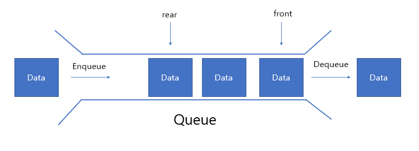

# 큐 (Queue)

큐(Queue)는 선형 자료구조로, 데이터를 추가한 순서대로 처리하는 구조입니다. 큐는 먼저 들어온 데이터가 가장 먼저 나가는 선입선출(FIFO, First In First Out)의 특징을 가지고 있습니다.

## 큐의 특징

- **선입선출(FIFO)**: 가장 먼저 들어온 데이터가 가장 먼저 나갑니다.
- **순서 유지**: 입력된 데이터의 순서를 유지합니다.
- **제한된 접근**: 항상 가장 앞에 있는 데이터만 접근 가능합니다.

## 주요 연산



- **enqueue**: 큐의 뒤쪽에 데이터를 추가합니다.
- **dequeue**: 큐의 앞쪽에서 데이터를 제거하고 반환합니다.
- **front**: 큐의 가장 앞에 있는 데이터를 반환합니다.
- **isEmpty**: 큐가 비어있는지 확인합니다.

## TypeScript 구현 예시

```typescript
class Queue<T> {
  private items: T[] = []

  // 큐가 비었는지 확인
  isEmpty(): boolean {
    return this.items.length === 0
  }

  // 데이터 추가
  enqueue(item: T): void {
    this.items.push(item)
  }

  // 데이터 제거 및 반환
  dequeue(): T | undefined {
    return this.items.shift()
  }

  // 첫 번째 데이터 확인
  front(): T | undefined {
    return this.items[0]
  }

  // 큐 출력
  print(): void {
    console.log(this.items.join(' '))
  }
}

// 사용 예시
const queue = new Queue<number>()
queue.enqueue(1)
queue.enqueue(2)
queue.enqueue(3)
queue.enqueue(4)
queue.enqueue(5)

queue.print() // 출력: 1 2 3 4 5

console.log(queue.dequeue()) // 출력: 1
console.log(queue.front()) // 출력: 2
```
