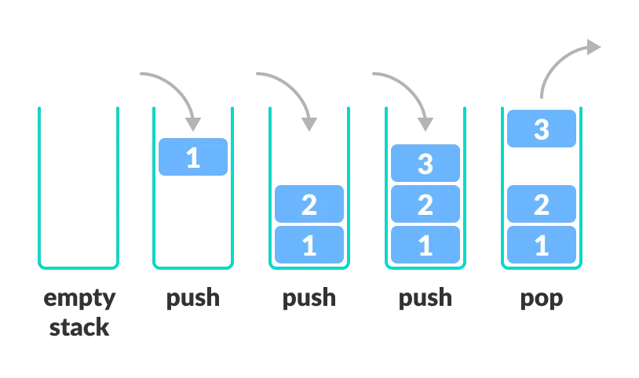

# 스택 (Stack)

스택은 데이터를 순서대로 쌓는 형태로 구성된 **선형 자료구조**입니다. 데이터를 추가할 때는 맨 위에 쌓고, 제거할 때도 맨 위의 데이터부터 제거됩니다. 이러한 방식은 후입선출(LIFO, Last In First Out) 구조라고 합니다.

## 스택의 특징



- **후입선출(LIFO)**: 가장 마지막에 들어온 데이터가 가장 먼저 나가는 구조입니다.
- **단순한 구조**: 구현이 간단하고 효율적입니다.
- **제한된 접근**: 항상 최상단 데이터만 접근 가능합니다.

## 주요 연산

- **push**: 데이터를 스택의 맨 위에 추가합니다.
- **pop**: 스택의 맨 위 데이터를 제거하고 반환합니다.
- **peek**: 스택의 맨 위 데이터를 제거하지 않고 반환합니다.
- **isEmpty**: 스택이 비어있는지 확인합니다.

## TypeScript 구현 예시

```typescript
class Stack<T> {
  private items: T[] = []

  // 스택이 비었는지 확인
  isEmpty(): boolean {
    return this.items.length === 0
  }

  // 데이터 추가
  push(item: T): void {
    this.items.push(item)
  }

  // 데이터 제거 및 반환
  pop(): T | undefined {
    return this.items.pop()
  }

  // 맨 위 데이터 확인
  peek(): T | undefined {
    return this.items[this.items.length - 1]
  }

  // 스택 출력
  print(): void {
    console.log(this.items.join(' '))
  }
}

// 사용 예시
const stack = new Stack<number>()
stack.push(1)
stack.push(2)
stack.push(3)
stack.push(4)
stack.push(5)

stack.print() // 출력: 1 2 3 4 5

console.log(stack.pop()) // 출력: 5
console.log(stack.peek()) // 출력: 4
```
